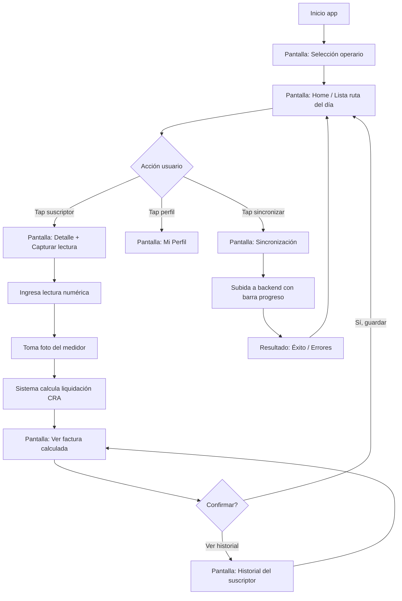

ñ# Diseño UX — MediApp (Sistema EPC Lecturas Rurales)

> **Documento dual-propósito**:
>
> 1. **Para Stitch / generadores text-to-UI**: cada pantalla incluye descripción narrativa rica + bullets estructurados de componentes para inferencia precisa de wireframes.
> 2. **Para presentación académica**: cuenta la historia completa desde el problema hasta la pantalla, en orden Persona → Journey → Flow → Wireframes.

---

## 1. Contexto y problema

En Colombia, los **prestadores rurales de servicios públicos de acueducto** atienden a poblaciones dispersas, con conectividad intermitente o inexistente, y operan con recursos limitados frente a la regulación tarifaria de la **Comisión de Regulación de Agua Potable y Saneamiento Básico (CRA)**.

**Diagnóstico del anteproyecto** _("Desarrollo de un sistema de liquidación tarifaria y validación fotográfica basado en una aplicación móvil y un backend institucional para prestadores rurales de servicios públicos vinculados a EPC")_:

> Solo el **17.03 % de los prestadores rurales** aplica correctamente la metodología CRA al momento de liquidar las tarifas mensuales.

Las consecuencias directas son:

- Cobros incorrectos a los suscriptores (sub o sobre-facturación).
- Pérdida de confianza de la comunidad en el prestador.
- Falta de evidencia auditable de las lecturas tomadas en terreno.
- Imposibilidad de demostrar trazabilidad ante la Superintendencia de Servicios Públicos.

**Hipótesis del proyecto**: una aplicación móvil **offline-first** que (a) capture lectura + foto del medidor con timestamp y geolocalización, (b) calcule la liquidación tarifaria localmente con la fórmula CRA correcta, y (c) sincronice contra un backend institucional cuando haya conectividad, eleva el porcentaje de aplicación correcta de la metodología por encima del 80 % en pilotos rurales.

---

## 2. Personas

### 2.1 Don Hernán — Operario rural (usuario primario)

**Perfil**:

- 47 años, vive en la vereda **El Manzano** (municipio de Cundinamarca).
- Estudió hasta noveno grado. Lee y escribe con fluidez, pero no está familiarizado con software complejo.
- Lleva **11 años** trabajando con el prestador EPC. Conoce a cada suscriptor por nombre.

**Contexto operativo**:

- Recorre **45 a 60 medidores por día**, distribuidos en un radio de 8 km, en moto.
- Salida típica: 6:30 AM. Regreso a la oficina del prestador: 1:00 - 2:00 PM.
- **Conectividad**: WiFi solo en la oficina del prestador (al inicio y al final del día). En ruta, **no hay señal celular** en la mayoría de los predios.

**Dispositivo**:

- Smartphone Android de gama media-baja (típicamente Xiaomi Redmi o similar, 4 GB RAM, Android 11-14).
- Pantalla de 6.5", uso con **una sola mano** mientras sostiene la moto, casco o linterna.
- Batería crítica: el día empieza al 100 % y debe terminar con carga suficiente para no perder datos.

**Objetivos**:

- Capturar las lecturas del día sin omitir ningún suscriptor de la ruta.
- Tener evidencia fotográfica de cada lectura para resolver reclamos posteriores.
- Llegar a la oficina y que la sincronización sea **automática y rápida**, sin tener que rehacer datos.

**Frustraciones (pain points reales)**:

- Hoy usa una **planilla de papel** que se moja con la lluvia o se pierde.
- Cuando hay un reclamo del suscriptor 3 días después, no puede demostrar la lectura tomada.
- Calcula las tarifas en una calculadora física al volver a la oficina, **se equivoca con frecuencia** porque la fórmula CRA tiene varios tramos y subsidios.
- Si su jefe le pide el "histórico" de un suscriptor, tiene que revisar planillas físicas de meses anteriores.

**Citas representativas** (estilo persona research):

> "Yo a la gente la conozco, pero acordarme cuánto consumieron el mes pasado, eso ya no."
> "Si la lluvia me moja la planilla, ese día se pierde y toca volver a la casa del señor."
> "Las cuentas las hago acá [señala calculadora], pero a veces me sale distinto que al patrón."

### 2.2 Marta — Administrativa del prestador EPC (usuaria secundaria, web)

**Perfil**:

- 38 años, técnica en sistemas, oficina del prestador.
- Recibe los datos sincronizados de los operarios al final del día.
- Genera reportes mensuales para la junta del acueducto y la Superintendencia.

**Objetivos**:

- Validar que todas las lecturas del día llegaron al servidor.
- Identificar suscriptores con consumos anómalos (fugas, fraude).
- Imprimir facturas para entrega física al mes siguiente.

**Nota de scope**: Marta **no es usuaria del MVP móvil**. Su flujo es vía backend / panel administrativo, fuera del alcance de este documento de wireframes.

---

## 3. Journey Map — Día típico de Don Hernán

| #   | Fase                                     | Acción de Don Hernán                                                                       | Lo que piensa                                       | Pain point actual (sin MediApp)                                          | Oportunidad MediApp                                                                                                     |
| --- | ---------------------------------------- | ------------------------------------------------------------------------------------------ | --------------------------------------------------- | ------------------------------------------------------------------------ | ----------------------------------------------------------------------------------------------------------------------- |
| 1   | **6:00 AM — Oficina**                    | Llega, agarra la planilla impresa con la ruta del día (40-60 suscriptores). Toma un tinto. | "A ver hoy a quién me toca."                        | Planilla en papel, una sola copia, se moja, se pierde.                   | Abre MediApp en oficina (con WiFi), **ve la lista de suscriptores precargados** ordenada por ruta.                      |
| 2   | **6:30 AM — Salida moto**                | Sale a la primera vereda. **Sin señal celular** desde acá hasta el regreso.                | "Ojalá no llueva."                                  | App tradicional moriría sin señal.                                       | **Offline-first**: todo funciona local, SQLite del celular.                                                             |
| 3   | **7:00 AM — Casa del primer suscriptor** | Saluda, va al medidor, anota lectura en planilla. Usa lápiz para no borrarse con humedad.  | "1247 metros cúbicos."                              | Anotación a mano: errores de transcripción, ilegible si la mano tiembla. | Abre detalle del suscriptor, ingresa lectura en teclado numérico grande.                                                |
| 4   | **7:02 AM — Misma casa**                 | Mira el medidor pero no tiene cómo "demostrar" la lectura si después hay reclamo.          | "Si me dice que no consumió tanto, qué le muestro." | **Cero evidencia visual.**                                               | **Toma foto del medidor** desde la app, con timestamp + hash de integridad.                                             |
| 5   | **7:05 AM — Misma casa**                 | Antes el cálculo lo hacía en la oficina.                                                   | "¿Cuánto le tocará pagar?"                          | Cálculo postergado, suscriptor no sabe el monto en el momento.           | App calcula la **liquidación CRA al instante** con la fórmula correcta y muestra el total estimado.                     |
| 6   | **7:10 - 12:30 PM — Ruta**               | Repite el ciclo en 40-60 casas. Hace dos descansos.                                        | "Llevo 27, me faltan 18."                           | No hay forma de saber **cuántas lleva** sin contar planilla.             | Pantalla **Home muestra contador**: "27 capturadas / 60 ruta".                                                          |
| 7   | **11:00 AM — Casa atípica**              | Suscriptor pregunta: "¿el mes pasado qué pagué?"                                           | "Mmm, no me acuerdo."                               | Sin acceso al histórico en terreno.                                      | Pantalla **Historial del suscriptor**: últimos 6 meses con lectura, consumo, total.                                     |
| 8   | **1:00 PM — Vuelta a oficina**           | Llega, deja la moto, prende el WiFi del celu.                                              | "Ahora a pasar todo al sistema."                    | **2 - 3 horas** de transcripción manual + cálculos.                      | App **detecta WiFi y sincroniza automáticamente** las 60 lecturas + fotos al backend.                                   |
| 9   | **1:15 PM — Pantalla sync**              | Ve barra de progreso, espera.                                                              | "Que no se trabe."                                  | N/A                                                                      | Pantalla **Sincronizar** muestra: "Subiendo 60 lecturas / 60 fotos. Pendientes: 23". Reintentos automáticos.            |
| 10  | **1:30 PM — Cierre**                     | Confirma que todo subió, apaga el celu, va a almorzar.                                     | "Listo, hoy sí está completo."                      | A veces se da cuenta días después que faltó un suscriptor.               | Pantalla final muestra **"Sincronización completa: 60/60"** con check verde, o lista de errores específicos a resolver. |

### Insights del journey map

1. **El offline NO es opcional**, es la columna vertebral del producto. Si una pantalla **necesita conexión** para funcionar, está rota.
2. **La foto es prueba**, no decoración. Va junto con timestamp + hash de integridad para que sea auditable.
3. **El feedback inmediato del cálculo** transforma la experiencia: el suscriptor sabe cuánto va a pagar **el mismo día** de la lectura.
4. **El contador de progreso** ("X de Y") da seguridad psicológica al operario en ruta.
5. **La sincronización es el momento más sensible**: tiene que ser explícito, visible y reintentable. Nunca silenciosa.

---

## 4. User Flow principal

### Estados clave del sistema

- **Offline detectado**: banner sutil arriba, NO bloqueante. App sigue funcionando 100 %.
- **Pendientes de sincronizar**: badge numérico permanente en icono de sincronización ("23").
- **Sincronización en progreso**: barra + contador, no se puede salir hasta que termine o se pause.
- **Error en captura**: validaciones inline (ej: lectura menor que la anterior → "¿Está seguro? Lectura anterior: 1247").

---

## 5. Sistema de diseño base

> Este sistema es **mínimo intencional**: 6 pantallas no justifican una librería de componentes Material Design completa. Foco en **legibilidad bajo sol directo** y **target táctil grande** (48dp mínimo).

### 5.1 Tipografía

- **Familia**: Inter o Roboto (sans-serif neutra, alta legibilidad en pantallas pequeñas).
- **Escala**:
  - `Display` 32 / 40 — Títulos de pantalla principal.
  - `Heading` 24 / 32 — Secciones.
  - `Body` 16 / 24 — Texto general.
  - `Caption` 13 / 18 — Metadatos, timestamps.
  - `Numeric XL` 56 / 64 — Display de lecturas y montos (lo más importante visualmente).

### 5.2 Paleta de colores

| Token           | Hex aprox                      | Uso                             |
| --------------- | ------------------------------ | ------------------------------- |
| `primary`       | `#0A6E8C` (azul agua profundo) | Acciones principales, header.   |
| `primary-light` | `#4FB3D9`                      | Highlights, links.              |
| `success`       | `#2E8B57`                      | Lecturas guardadas, sync OK.    |
| `warning`       | `#E8A547`                      | Pendientes, conexión inestable. |
| `error`         | `#C8434E`                      | Validaciones, fallos sync.      |
| `neutral-900`   | `#1A1A1A`                      | Texto principal.                |
| `neutral-600`   | `#666666`                      | Texto secundario.               |
| `neutral-200`   | `#E5E5E5`                      | Bordes, separadores.            |
| `neutral-50`    | `#F8F8F8`                      | Fondo.                          |

**Razón de la paleta**: azul "agua" refuerza el dominio (acueducto rural). Contrastes WCAG AA+ para legibilidad bajo sol.

### 5.3 Componentes reutilizables

- **`SuscriptorCard`** — card horizontal con: avatar inicial, nombre, código, dirección, badge de estado de captura (pendiente / capturado / sincronizado).
- **`BotonPrincipal`** — full-width, 56dp alto, primary, sombra suave. Una sola acción por pantalla.
- **`BotonSecundario`** — outlined, mismo tamaño que principal.
- **`InputNumerico`** — input grande con teclado numérico nativo, label flotante, validación inline.
- **`BadgeEstado`** — pill pequeña con color semántico (`pendiente`, `capturado`, `sincronizado`, `error`).
- **`HeaderPantalla`** — título + botón back + acción opcional derecha (icono).
- **`ContadorProgreso`** — "27 / 60" con barra horizontal debajo.
- **`AlertaInline`** — banner amarillo / rojo con ícono + mensaje + acción opcional.

### 5.4 Espaciado

Escala de 4: `4, 8, 12, 16, 24, 32, 48, 64`. Padding base de pantalla: `16dp` lateral, `24dp` superior.

### 5.5 Iconografía

Iconos line-style 24dp (sugerencia: **Lucide** o **Phosphor**). Iconos clave:

- `home`, `user`, `camera`, `cloud-upload`, `wifi-off`, `check-circle`, `alert-triangle`, `chevron-right`, `history`.

---

## 6. Wireframes — Pantallas móviles

> **Para Stitch / generadores text-to-UI**: cada pantalla está descrita en formato C (narrativa rica + bullets estructurados). Los bullets enumeran componentes en orden visual top-to-bottom; la narrativa da contexto de uso.

---

### 6.1 Pantalla 1 — Selección de Operario

**Propósito**: Al abrir la app por primera vez (o tras un cierre forzado), Don Hernán identifica quién es. Sin login formal porque el dispositivo es asignado al operario y la confianza es alta. Es una **pantalla simple, casi una bienvenida**, que también funciona como check de "estoy listo para arrancar el día".

**Narrativa de layout**:

> La pantalla muestra un fondo blanco limpio con el logo de MediApp centrado en el tercio superior, debajo un saludo grande "Buen día" y la fecha del día en formato legible ("Lunes 5 de mayo, 2026"). En el centro vertical, un dropdown grande full-width donde se selecciona el operario de una lista corta (típicamente 1 a 5 operarios por prestador). Debajo, un botón principal "Entrar" deshabilitado hasta que se seleccione un operario. En el footer, texto pequeño con la versión de la app y el nombre del prestador EPC.

**Componentes** (top → bottom):

- Logo MediApp (centrado, 80dp).
- Texto `Display`: "Buen día".
- Texto `Body` neutral-600: fecha actual formato largo en español.
- Spacer 48dp.
- Label `Caption`: "¿Quién toma las lecturas hoy?".
- `Dropdown` full-width con placeholder "Seleccionar operario": opciones "Hernán Díaz Pérez", "María Rincón", "Luis Cortés".
- Spacer 32dp.
- `BotonPrincipal` "Entrar" (deshabilitado sin selección).
- Footer fijo abajo: "MediApp v0.1 · EPC Acueducto Manzano", `Caption` neutral-600.

**Estados**:

- Sin selección → botón deshabilitado, opacidad 50 %.
- Con selección → botón activo, color primary, ripple en tap.

---

### 6.2 Pantalla 2 — Home / Lista ruta del día

**Propósito**: Es **la pantalla central del día** para Don Hernán. Le muestra de un vistazo: cuántos suscriptores debe visitar hoy, cuántos lleva capturados, cuántos faltan, y le permite **tappear cualquier suscriptor para registrar su lectura**. También es desde acá que accede a sincronizar al final del día y a su perfil.

**Narrativa de layout**:

> Header azul primary fijo arriba con el título "Ruta de hoy" a la izquierda en blanco, y a la derecha dos iconos: un avatar circular pequeño (perfil) y un icono de nube con un badge numérico rojo "23" indicando lecturas pendientes de sincronizar. Debajo del header, una franja con un contador grande ("27 / 60") y una barra de progreso horizontal verde que se llena proporcionalmente. Si la app detecta que está offline, debajo del contador aparece un banner amarillo sutil "Sin conexión — los datos se guardarán acá hasta que vuelvas a la oficina". El cuerpo principal es una lista scrolleable de cards de suscriptores, agrupados por sección con headers tipo "📍 Vereda El Manzano (45)", "📍 Vereda La Florida (15)". Cada card muestra: número de orden grande a la izquierda, nombre del suscriptor en bold, dirección en gris, código de cliente en pequeño, y un badge de estado a la derecha (pendiente naranja / capturado verde / con ícono de nube si ya sincronizó). Tap en cualquier card lleva a la pantalla de captura. Footer fijo abajo con un botón secundario "Sincronizar (23 pendientes)" full-width que cambia a "✓ Todo sincronizado" en verde cuando no hay nada pendiente.

**Componentes** (top → bottom):

- `HeaderPantalla` primary:
  - Título: "Ruta de hoy".
  - Acciones derecha: avatar perfil (32dp), icono nube con `BadgeEstado` rojo "23".
- Sección hero:
  - `ContadorProgreso` "27 / 60 capturadas".
  - Barra horizontal verde 8dp, ancho proporcional.
- `AlertaInline` warning (condicional offline): "Sin conexión — los datos se guardarán acá".
- Lista scrolleable:
  - Section header: "📍 Vereda El Manzano (45)".
  - 5 a 10 `SuscriptorCard`:
    - Número orden (32dp, neutral-600).
    - Nombre suscriptor (`Body` bold).
    - Dirección (`Caption` neutral-600).
    - Código (`Caption` neutral-600, alineado derecha o segunda línea).
    - `BadgeEstado` derecha.
  - Section header: "📍 Vereda La Florida (15)".
  - Más cards.
- Footer fijo:
  - `BotonSecundario` outlined full-width: "Sincronizar (23 pendientes)" (estado normal) / "✓ Todo sincronizado" (estado sin pendientes, verde).

**Estados**:

- **Offline**: banner amarillo visible.
- **Online sin pendientes**: footer verde "✓ Todo sincronizado".
- **Sincronización en progreso**: footer cambia a barra de progreso "Sincronizando 12 / 23...".
- **Card pendiente**: badge naranja "Pendiente".
- **Card capturada local**: badge azul "Capturada" + icono pequeño nube tachada.
- **Card sincronizada**: badge verde "Enviada" + icono check.

---

### 6.3 Pantalla 3 — Capturar Lectura

**Propósito**: Don Hernán está parado frente al medidor del suscriptor. Necesita ingresar el número que ve, tomar una foto, y guardar. La pantalla está diseñada para **uso con una sola mano**, target táctiles grandes, y feedback inmediato si la lectura es sospechosa (menor que la anterior, salto enorme, etc.).

**Narrativa de layout**:

> Header simple con flecha back a la izquierda, título "Capturar lectura" centrado, e icono de info a la derecha. Debajo, una card con la información del suscriptor: foto/avatar inicial grande, nombre completo, código de cliente, dirección. Un divisor horizontal, y debajo una sección destacada con la lectura anterior en grande ("Anterior: 1247 m³") y el período al que corresponde. La pieza central de la pantalla es un input numérico GIGANTE (display 56pt) con label "Lectura actual (m³)" donde el operario tipea el número que ve en el medidor. El teclado nativo numérico se abre al tap. Debajo del input, una validación dinámica: si el número ingresado es menor que el anterior o el consumo calculado es mayor a 50 m³, muestra una alerta inline naranja "Consumo inusual: 67 m³. Verificá el medidor." Debajo, un botón grande con ícono de cámara "Tomar foto del medidor" que abre la cámara nativa. Una vez tomada la foto, el botón se reemplaza por un thumbnail con un check verde "Foto guardada" y opción de "Cambiar". En el footer, dos botones: "Cancelar" secundario y "Guardar y calcular" principal full-width-ish, deshabilitado hasta tener lectura + foto.

**Componentes** (top → bottom):

- `HeaderPantalla`:
  - Back arrow izquierda.
  - Título: "Capturar lectura".
  - Acción derecha: icono info (abre tooltip con instrucciones).
- Card suscriptor:
  - Avatar inicial (48dp).
  - Nombre `Heading`: "Hernando López Quiroga".
  - Código `Caption` neutral-600: "Cliente: 00237".
  - Dirección `Body`: "Vereda El Manzano, finca La Esperanza".
- Divisor.
- Sección "Lectura anterior":
  - Label `Caption`: "Última lectura registrada".
  - Valor `Heading`: "1247 m³".
  - Sub-label `Caption`: "Período: Abril 2026".
- Spacer 32dp.
- `InputNumerico`:
  - Label flotante: "Lectura actual (m³)".
  - Display `Numeric XL`: cursor parpadeante, valor.
  - Teclado numérico nativo al focus.
- `AlertaInline` warning (condicional): "Consumo inusual: 67 m³. Verificá el medidor."
- Spacer 24dp.
- Sección "Evidencia fotográfica":
  - Estado vacío: `BotonPrincipal` con ícono cámara "Tomar foto del medidor".
  - Estado con foto: thumbnail 80dp + check verde + texto "Foto guardada (203 KB)" + link "Cambiar".
- Spacer flex.
- Footer:
  - `BotonSecundario` "Cancelar" (1/3 ancho).
  - `BotonPrincipal` "Guardar y calcular" (2/3 ancho), deshabilitado sin lectura+foto.

**Estados**:

- **Sin datos**: input vacío, botón foto vacío, guardar deshabilitado.
- **Lectura ingresada sin foto**: input lleno, botón foto vacío, guardar deshabilitado.
- **Todo completo**: guardar habilitado, color primary brillante.
- **Validación lectura menor que anterior**: alerta roja "Lectura menor que la anterior. ¿Querés corregir?".
- **Validación consumo alto**: alerta naranja "Consumo inusual".
- **Procesando**: spinner en botón guardar, deshabilitado.

---

### 6.4 Pantalla 4 — Ver Factura Calculada

**Propósito**: Inmediatamente después de guardar la lectura, MediApp **calcula la liquidación CRA local** y le muestra a Don Hernán el resultado para que pueda comunicárselo al suscriptor en ese mismo momento. Es una pantalla de **resumen claro y confiable**, con el monto total como elemento dominante.

**Narrativa de layout**:

> Header azul primary con flecha back, título "Factura calculada", e icono share a la derecha (futuro: enviar por WhatsApp). El cuerpo arranca con un check verde grande circular y el texto "Lectura registrada" como confirmación visual. Debajo, una card destacada con el suscriptor (avatar, nombre, código). Luego una sección "Resumen del consumo" con tres datos en fila: lectura anterior, lectura actual, consumo (m³). Después la pieza central: el "Total a pagar" en tipografía gigante (Numeric XL) con el monto formateado en pesos colombianos ("$ 38.450"). Debajo, un breakdown plegable "Ver detalle del cálculo" que al expandir muestra los componentes: cargo fijo, consumo básico subsidiado, consumo complementario, subsidio aplicado, total. Una sección menor con metadatos: fecha de captura, operario, hash de integridad (en formato corto, solo informativo). En el footer, dos botones: "Ver historial" secundario (lleva a la pantalla 5) y "Volver a la ruta" principal (lleva al Home).

**Componentes** (top → bottom):

- `HeaderPantalla` primary:
  - Back arrow.
  - Título: "Factura calculada".
  - Acción derecha: icono share (deshabilitado en MVP).
- Banner success:
  - Ícono check circular verde (64dp).
  - Texto `Heading`: "Lectura registrada".
- Card suscriptor compacta:
  - Avatar + nombre + código.
- Sección "Consumo":
  - Tres bloques en fila horizontal:
    - "Anterior: 1247 m³"
    - "Actual: 1267 m³"
    - "Consumo: **20 m³**" (resaltado).
- Spacer 24dp.
- Sección "Total a pagar":
  - Label `Caption` centrado: "Total a pagar".
  - Valor `Numeric XL` centrado: "$ 38.450".
- Acordeón plegable "Ver detalle del cálculo":
  - Cargo fijo: $ 8.200
  - Consumo básico (15 m³ × $ 1.450): $ 21.750
  - Consumo complementario (5 m³ × $ 2.100): $ 10.500
  - Subsidio estrato 2 (-15 %): -$ 6.067
  - Recargo aseo: $ 4.067
  - **Total: $ 38.450**
- Sección metadatos (`Caption` neutral-600):
  - "Capturado: 5 may 2026, 7:23 AM".
  - "Operario: Hernán Díaz Pérez".
  - "Hash: a3f9...c421".
- Footer:
  - `BotonSecundario` "Ver historial" (1/2).
  - `BotonPrincipal` "Volver a la ruta" (1/2).

**Estados**:

- **Cálculo OK**: como descrito.
- **Cálculo con advertencia** (subsidio no aplicable, consumo anormal): banner amarillo encima del total.
- **Acordeón cerrado por defecto** (un tap para expandir).

---

### 6.5 Pantalla 5 — Historial del Suscriptor

**Propósito**: Cuando un suscriptor le pregunta a Don Hernán "¿qué pagué el mes pasado?" o cuando necesita revisar tendencias, esta pantalla le muestra los **últimos 6 períodos** del suscriptor con lectura, consumo, total y un mini gráfico de tendencia.

**Narrativa de layout**:

> Header back + título "Historial" + acción derecha vacía. Card pequeña con el suscriptor identificado. Debajo, una sección "Resumen del año" con tres KPIs en fila: consumo promedio, mes pico, total acumulado. Luego una mini-gráfica de barras (sparkline, 6 barras = 6 meses) con los consumos para detectar tendencias visualmente. La pieza central es una lista cronológica DESC de los últimos 6 períodos: cada fila muestra el período (mes año), consumo en m³, total pagado, y un chevron a la derecha para ver el detalle de esa factura específica. La fila más reciente tiene un highlight sutil. Footer con botón "Volver".

**Componentes** (top → bottom):

- `HeaderPantalla`:
  - Back arrow.
  - Título: "Historial".
- Card suscriptor compacta.
- Sección "Resumen del año":
  - 3 KPIs horizontales:
    - "Promedio: 18 m³".
    - "Pico: 32 m³ (oct 2025)".
    - "Total: $ 412.300".
- Mini-chart:
  - 6 barras verticales etiquetadas con mes corto (nov, dic, ene, feb, mar, abr).
  - Altura proporcional al consumo, color primary-light, barra del mes pico en warning.
- Spacer 16dp.
- Header sección: "Últimos 6 períodos".
- Lista (cards o filas):
  - Fila 1 (más reciente, highlight): "Abril 2026 · 20 m³ · $ 38.450 · ›"
  - Fila 2: "Marzo 2026 · 19 m³ · $ 36.200 · ›"
  - ... 4 filas más.
- Footer:
  - `BotonPrincipal` full-width "Volver".

**Estados**:

- **Suscriptor con historial completo**: como descrito.
- **Suscriptor nuevo (< 3 meses)**: muestra solo lo que hay con mensaje "Histórico limitado. Necesita más períodos para ver tendencias."
- **Tap en fila**: navega a Pantalla 4 (Ver Factura) en modo solo-lectura para ese período.

---

### 6.6 Pantalla 6 — Sincronización

**Propósito**: Al final del día, Don Hernán llega a la oficina, conecta WiFi, abre esta pantalla. La app sube todas las lecturas + fotos pendientes al backend. Es una pantalla **transaccional, transparente, con feedback visual constante**, porque acá se siente la confianza o se rompe.

**Narrativa de layout**:

> Header con título "Sincronización" centrado y back arrow. Estado superior con un ícono grande circular: nube con flecha hacia arriba si está sincronizando, check verde si terminó OK, alerta roja si hubo errores. Debajo del ícono, un texto descriptivo del estado actual ("Subiendo lecturas al servidor..." / "Sincronización completa" / "3 errores requieren atención"). Pieza central: una barra de progreso grande con porcentaje numérico ("78 %") y debajo el detalle "Subiendo lectura 47 de 60". Más abajo, una mini-tabla con tres contadores en fila: lecturas enviadas (47), fotos enviadas (45), fallidas (0). Si hay errores, una sección expandible "Ver errores" con la lista de suscriptores que fallaron y la razón. Footer condicional: "Cancelar" durante sync, "Reintentar fallidos" si hubo errores, "Volver al inicio" si todo OK.

**Componentes** (top → bottom):

- `HeaderPantalla`:
  - Back arrow (deshabilitado durante sync activa).
  - Título: "Sincronización".
- Hero estado:
  - Ícono grande 96dp circular:
    - Animado nube + flecha arriba (sincronizando).
    - Check verde estático (OK).
    - Alerta roja (con errores).
  - Texto `Heading`: estado descriptivo.
  - Texto `Body` neutral-600: timestamp última sync exitosa ("Última sync: hoy 12:48 PM").
- Sección progreso:
  - Barra horizontal grande 12dp altura.
  - Porcentaje grande `Heading`: "78 %".
  - Detalle `Caption`: "Subiendo lectura 47 de 60".
- Sección contadores (3 columnas):
  - "✓ Lecturas: 47 / 60".
  - "📷 Fotos: 45 / 60".
  - "✗ Fallidas: 0".
- Sección errores (condicional, plegable):
  - Header: "Ver 3 errores" con chevron.
  - Lista expandida:
    - Suscriptor + razón ("00237 H. López — Foto demasiado grande, reintentá").
    - Suscriptor + razón.
- Footer (cambia según estado):
  - **Sincronizando**: `BotonSecundario` "Pausar sincronización".
  - **Completo OK**: `BotonPrincipal` full-width verde "Volver al inicio".
  - **Con errores**: `BotonSecundario` "Volver" + `BotonPrincipal` "Reintentar fallidos".

**Estados**:

- **Inicial (no se ha sincronizado nunca)**: hero gris con ícono de nube neutra, mensaje "23 lecturas listas para enviar", botón "Iniciar sincronización".
- **En progreso**: barra moviéndose, botón pausar disponible.
- **Pausada**: barra estática, botón "Reanudar".
- **Éxito total**: hero verde, confetti sutil opcional, botón volver.
- **Éxito parcial**: hero amarillo, sección errores visible, botón reintentar.
- **Sin conexión**: alerta roja superior "No hay WiFi. Conectate al WiFi de la oficina para sincronizar.", botón sync deshabilitado.

---

### 6.7 Pantalla 7 — Mi Perfil

**Propósito**: Don Hernán accede acá desde el avatar del Home. Pantalla utilitaria con su info, estadísticas del día / semana, configuración mínima, y opción de cerrar sesión (que en práctica solo vuelve a la pantalla de selección de operario).

**Narrativa de layout**:

> Header simple con back y título "Mi Perfil". Hero con avatar grande circular centrado (foto o iniciales), nombre completo debajo en heading, y rol en caption ("Operario rural · EPC Manzano"). Sección "Estadísticas" con cards horizontales: "Hoy: 27 lecturas", "Esta semana: 142", "Este mes: 587". Sección "Información" con filas tipo settings: documento de identidad, teléfono, fecha ingreso al prestador. Sección "Configuración" con switches: "Notificaciones de sincronización", "Modo alto contraste". Footer con botón secundario rojo outlined "Cerrar sesión" (en realidad cambia operario activo).

**Componentes** (top → bottom):

- `HeaderPantalla`:
  - Back arrow.
  - Título: "Mi Perfil".
- Hero centrado:
  - Avatar 96dp circular con iniciales "HD" o foto.
  - Nombre `Display`: "Hernán Díaz Pérez".
  - Rol `Caption` neutral-600: "Operario rural · EPC Manzano".
- Sección "Tu actividad":
  - Header `Heading`: "Tu actividad".
  - 3 cards horizontales (scroll horizontal o grid 3 columnas):
    - "Hoy: 27 lecturas".
    - "Esta semana: 142".
    - "Este mes: 587".
- Sección "Información personal":
  - Header `Heading`: "Información".
  - Filas tipo lista:
    - "Documento: 79.234.567".
    - "Teléfono: +57 312 456 7890".
    - "Ingresó: Marzo 2015".
- Sección "Configuración":
  - Header `Heading`: "Configuración".
  - Filas con switch:
    - "Avisos al sincronizar" [switch ON].
    - "Modo alto contraste" [switch OFF].
    - "Tamaño de letra grande" [switch OFF].
- Footer:
  - `BotonSecundario` outlined error full-width: "Cambiar de operario".

**Estados**:

- Pantalla solo-lectura. Único interactivo: switches (persistentes localmente) y botón cambiar operario (vuelve a Pantalla 1).

---

## 7. Anexo técnico (resumen para presentación)

### 7.1 Stack

| Capa               | Tecnología                           | Razón                                          |
| ------------------ | ------------------------------------ | ---------------------------------------------- |
| App móvil          | React Native + Expo SDK 54           | Cross-platform, dev rápido, un solo codebase.  |
| Lenguaje           | TypeScript 5.9 strict                | Tipado fuerte, refactor seguro.                |
| Persistencia local | SQLite vía `expo-sqlite`             | Offline-first, transaccional, embebido.        |
| Dominio puro       | TypeScript modular hexagonal         | Lógica testeable, agnóstica de I/O.            |
| Testing            | Jest + ts-jest, 500 tests verde      | TDD estricto en lógica de negocio.             |
| Backend            | (a definir, ver tabla de decisiones) | Solo persiste, no recalcula.                   |
| Sincronización     | PUSH-only desde móvil                | Simplifica conflictos, fuente de verdad clara. |

### 7.2 Decisiones arquitectónicas clave

1. **Offline-first NO opcional**: SQLite local es la fuente de verdad temporal hasta que sincronice.
2. **Cálculo CRA en el cliente**: la fórmula de liquidación corre 100 % en el móvil. El backend solo persiste resultados.
3. **Hexagonal en dominio**: `src/{modulo}/` es puro TS. I/O (SQLite, crypto, HTTP) vive en adapters.
4. **Ports `Hasher` e `IdGenerator`**: adapters universales (`js-sha256` + `uuid`) funcionan idénticos en Node y RN.
5. **Adapters paralelos por plataforma**: `better-sqlite3` (Node, tests) y `expo-sqlite` (RN, runtime móvil).
6. **Sin login**: dispositivo asignado, dropdown selección de operario al inicio.
7. **Foto + hash SHA-256**: cada captura genera un hash de integridad para auditoría posterior.

### 7.3 Estado del desarrollo (al cierre del día 1 del sprint)

- 500 / 500 tests automatizados en verde.
- Dominio TypeScript modular con 12 módulos: motor tarifario, factura, lecturas, sincronización, auditoría, etc.
- Persistencia SQLite local validada en el dispositivo Android del estudiante.
- App móvil corriendo sobre Expo Go con la primera pantalla de prueba operativa.
- Roadmap restante: 6 pantallas finales + integración cámara + backend + sincronización end-to-end + manual de usuario.

---

## 8. Glosario rápido

| Término                | Significado                                                                             |
| ---------------------- | --------------------------------------------------------------------------------------- |
| **CRA**                | Comisión de Regulación de Agua Potable y Saneamiento Básico.                            |
| **EPC**                | Empresa Prestadora Comunitaria (acueducto rural).                                       |
| **Suscriptor**         | Persona o predio que recibe el servicio de acueducto.                                   |
| **Liquidación**        | Cálculo del monto a cobrar por el período.                                              |
| **Estrato**            | Clasificación socioeconómica colombiana (1-6) que afecta subsidios.                     |
| **Vereda**             | Subdivisión rural más pequeña que el municipio.                                         |
| **Offline-first**      | Patrón de diseño donde la app funciona completamente sin conexión y sincroniza después. |
| **Hash de integridad** | Huella criptográfica (SHA-256) que demuestra que un dato no fue alterado.               |

---

> **Nota final para Stitch**: las pantallas 1 a 7 están descritas en el orden recomendado de generación de wireframes. Si necesita priorizar, **las pantallas 2 (Home), 3 (Capturar) y 4 (Factura) son el corazón del producto**; las demás son soporte.
